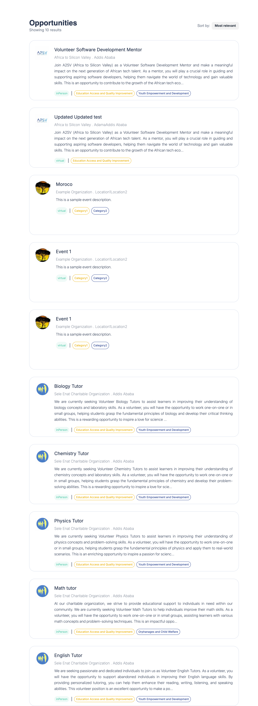

# Job Listing Platform

This project is a job listing platform built with NextJs and TypeScript. It allows users to view job opportunities and sort them by relevance or alphabetically. The project utilizes Tailwind CSS for styling and includes various components like JobCard and JobLister to manage and display job data. State management and data fetching are handled using Redux and RTK Query, providing a robust and scalable architecture.




## Features
- **Job Listing**: Displays a list of job opportunities with detailed descriptions.
- **Sorting Functionality**: Sort job listings by "Most relevant" or "Alphabetically."
- **Responsive Design**: The application is designed to work on various screen sizes.
- **Dynamic Routing**: Navigate to detailed job views using dynamic routing.
- **State Management with Redux**: Global state management is implemented using Redux, ensuring consistent state across the application.

- **Data Fetching with RTK Query**: Efficient and powerful data fetching is handled by RTK Query, simplifying API integration.


.png>)


## Installation

To get started with the project, follow these steps:

1. **Clone the repository**:
   ```bash
   git clone https://github.com/Natib22/A2SV-project-phase
   cd A2SV-project-phase
   cd job-listing-platform
   ```

2. **Install dependencies**:
   Make sure you have [Node.js](https://nodejs.org/) installed. Then, install the required dependencies using npm or yarn:
   ```bash
   npm install
   ```
   or
   ```bash
   yarn install
   ```


## Running the Project

To run the project locally, use the following command:

```bash
npm run dev
```

or

```bash
yarn dev
```

This will start the development server, and you can view the application in your browser at `http://localhost:3000`.

## Usage

Once the project is running, you can:

- Browse the list of job opportunities.
- Sort the job listings by selecting the "Sort by" dropdown.
- Click on a job card to view detailed information about the job.

